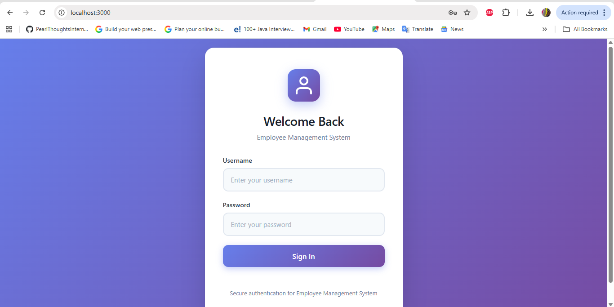
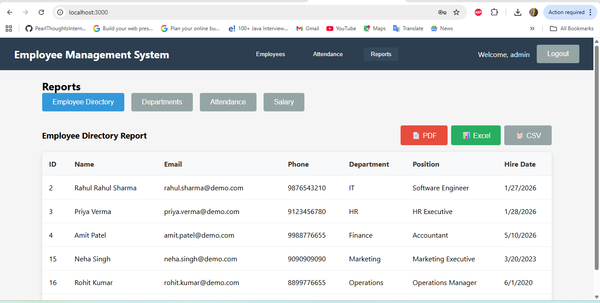

# Employee Management System

A web application I built to manage employee records, track attendance, and generate reports. This was my first full-stack project where I learned how frontend and backend work together.



## What It Does

This system helps manage employees in a company. You can add new employees, update their information, track who's present each day, and generate reports about departments and salaries. I built it to understand how real business applications work.

## Why I Built This

I wanted to learn full-stack development by building something practical. Instead of just following tutorials, I decided to create an actual application that solves a real problem. Through this project, I learned:

- How React components work and communicate
- Building REST APIs with ASP.NET Core
- Connecting a frontend to a backend
- Working with databases and relationships
- Handling errors properly
- Making things look good with CSS

## Tech Stack

**Frontend:**
- React with TypeScript
- Plain CSS for styling
- Axios for API calls

**Backend:**
- ASP.NET Core 8.0 (Web API)
- Entity Framework Core
- C#

**Database:**
- MySQL 8.0

I chose this stack because I wanted to learn both JavaScript and C#, and understand how they work together in a real application.

## Screenshots

### Managing Employees


You can add, edit, and delete employees. The form validates everything before saving.

### Reports


Generate different reports like department statistics, attendance summaries, and salary breakdowns. You can export them too.

## Getting Started

### What You Need

- Node.js (18 or newer)
- .NET SDK 8.0
- MySQL Server 8.0
- Git

### Setting Up the Database

1. Make sure MySQL is running
2. Open a terminal and run:
```bash
mysql -u root -p < setup-database.sql
```

This creates the database, tables, and adds some sample data including an admin user.

If you're on Windows, you can also just double-click `reset-database.bat`.

### Running the Backend

```bash
cd EmployeeManagementAPI
dotnet restore
dotnet run
```

The API will start at http://localhost:5000

Or just double-click `start-backend.bat` if you're on Windows.

**Important:** Update `appsettings.json` with your MySQL password before running.

### Running the Frontend

```bash
cd employee-management-frontend
npm install
npm start
```

The app will open at http://localhost:3000

Or double-click `start-frontend.bat` on Windows.

## Using the Application

**Login:**
- Username: `admin`
- Password: `admin123`

Once you're in:
- **Employees tab** - Add, edit, or delete employee records
- **Attendance tab** - Mark who's present, absent, or late
- **Reports tab** - View statistics and export data

## How It Works

The frontend (React) runs in your browser and talks to the backend (ASP.NET) through HTTP requests. The backend handles all the business logic and talks to MySQL to store and retrieve data.

For example, when you add an employee:
1. You fill out the form in React
2. React sends the data to the API
3. The API validates it and saves to MySQL
4. MySQL confirms it's saved
5. The API tells React it worked
6. React updates the screen

## Project Structure

```
├── EmployeeManagementAPI/          # Backend code
│   ├── Controllers/                # API endpoints
│   ├── Models/                     # Data models
│   └── Data/                       # Database stuff
│
├── employee-management-frontend/   # Frontend code
│   └── src/
│       ├── components/             # React components
│       ├── services/               # API calls
│       └── types/                  # TypeScript types
│
├── screenshots/                    # App screenshots
├── setup-database.sql              # Database setup
└── README.md                       # This file
```

## Features

- **Employee Management** - Full CRUD operations (Create, Read, Update, Delete)
- **Attendance Tracking** - Record daily attendance with notes
- **Reports** - Department stats, attendance summaries, salary reports
- **Data Export** - Download reports as CSV, Excel, or PDF
- **Form Validation** - Checks data on both frontend and backend
- **Error Handling** - Shows clear messages when something goes wrong
- **Responsive Design** - Works on different screen sizes

## Challenges I Faced

**CORS Issues:** When I first connected the frontend to backend, I got CORS errors. I learned about cross-origin requests and how to configure them properly.

**State Management:** Understanding when React components re-render was tricky. I spent time learning about useState and useEffect hooks.

**Database Relationships:** Setting up foreign keys between employees and attendance records took some trial and error.

**Error Handling:** Making sure errors from the database show up nicely in the UI required work on both frontend and backend.

**TypeScript:** Coming from JavaScript, TypeScript's strict typing was frustrating at first, but it caught so many bugs before runtime.

## What I Learned

This project taught me way more than just coding. I learned:

- How to structure a real application
- Why separating frontend and backend makes sense
- The importance of validation on both client and server
- How to debug across multiple layers
- Reading documentation when stuck
- Git for version control
- Writing code that others can understand

## Things I'd Improve

If I had more time, I would:
- Add JWT authentication instead of basic login
- Hash passwords properly (right now they're plain text)
- Add pagination for large employee lists
- Write unit tests
- Deploy it to a cloud platform
- Add more detailed error logging
- Implement role-based permissions

## Notes

This is a learning project, so some things are simplified:
- Passwords aren't hashed (don't do this in production!)
- No JWT tokens, just basic auth
- Limited error handling in some places
- No automated tests yet

But it works, and I'm proud of it. It taught me how full-stack applications actually work.

